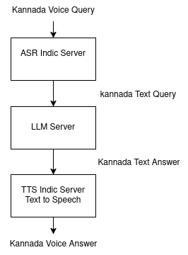
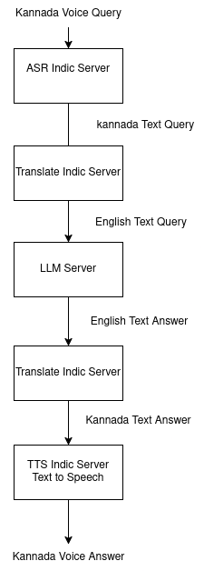

# dwani.ai - Knowledge from Curiosity

## Overview

dwani.ai is a Multimodal Document Analytics platform 

It can be self-hosted and designed for Indian + European languages . 

- Download PDF - [dwani.ai - Workshop Slides](https://dwani.ai/dwani-ai-workshop.pdf)

- live demo - [https://workshop.dwani.ai](https://workshop.dwani.ai)

### Install the library
```bash
pip install --upgrade dwani
```

### Setup the credentials
```python
import dwani
import os

dwani.api_key = os.getenv("DWANI_API_KEY")

dwani.api_base = os.getenv("DWANI_API_BASE_URL")
```

### Examples

#### Text Query 
```python
resp = dwani.Chat.create(prompt="Hello!", src_lang="english", tgt_lang="kannada")
print(resp)
```

#### Vision Query
```python
result = dwani.Vision.caption(
    file_path="image.png",
    query="Describe this logo",
    src_lang="english",
    tgt_lang="kannada"
)
print(result)
```

#### Speech to Text -  Automatic Speech Recognition (ASR)
```python
result = dwani.ASR.transcribe(file_path="kannada_sample.wav", language="kannada")
print(result)
```

#### Text to Speech -  Speech Synthesis
- For mp3 file
```python
response = dwani.Audio.speech(input="ಕರ್ನಾಟಕದ ರಾಜಧಾನಿ ಯಾವುದು", response_format="mp3")
with open("output.mp3", "wb") as f:
    f.write(response)
```
- for wav file
```python
response = dwani.Audio.speech(input="ಕರ್ನಾಟಕ ದ ರಾಜಧಾನಿ ಯಾವುದು", response_format="wav")
with open("output.wav", "wb") as f:
    f.write(response)
```

### Translate
``` python
result = dwani.Translate.run_translate(sentences="hi, how are you?", src_lang="english", tgt_lang="kannada")
print(result)
```

## Workshop steps

### For Development 
- **Prerequisites**: Python 3.10
- **Steps**:
  1. **Create a virtual environment**:
  ```bash
  python -m venv venv
  ```
  2. **Activate the virtual environment**:
  ```bash
  source venv/bin/activate
  ```
  On Windows, use:
  ```bash
  venv\Scripts\activate
  ```
  3. **Install dependencies**:
  - ```bash
    pip install -r requirements.txt
    ```
  4. **Run the Program**:
  - ```bash
    python workshop_demo.py
    ```

- To Run the program
  - DWANI_API_BASE_URL and DWANI_API_KEY environment variables has to be set
    - export DWANI_API_BASE_URL=http://example.com
    - export DWANI_API_KEY='your_api_key_here'

  - Please email us to get the IP for dwani.ai - workshop inference server


### dwani.ai Features and Commands

| Feature                  | Code                                      | Gradio Demo                                                                 | Server  |
|--------------------------|----------------------------------------------|----------------------------------------------|-----------------------------------------------------------------------------|
| Chat / Text Answer       | `python intro/llm_chat.py`                  | [Chat UX](https://chat-demo.dwani.ai)            |[https://github.com/dwani-ai/llm-indic-server](https://github.com/dwani-ai/llm-indic-server)|
| Vision Query              | `python intro/vision.py`                  | [Vision Query UX](https://vision-demo.dwani.ai) | [https://github.com/dwani-ai/llm-indic-server](https://github.com/dwani-ai/llm-indic-server)|
| Translate                | `python intro/translate.py`             | [Translate UX](https://translate-demo.dwani.ai)  |[https://github.com/dwani-ai/indic-translate-server](https://github.com/dwani-ai/indic-translate-server)|
| Speech to Text / Transcribe     | `python intro/transcribe.py`            | [ASR/ Speech to Text UX](https://asr-demo.dwani.ai) |[https://github.com/dwani-ai/asr-indic-server](https://github.com/dwani-ai/asr-indic-server)|
| Text to Speech           | `python intro/text_to_speech.py`        | [Text to Speech UX](https://tts-demo.dwani.ai) | [https://github.com/dwani-ai/tts-indic-server](https://github.com/dwani-ai/tts-indic-server)|
| PDF Query                 | `python intro/pdf_query.py`              | [PDF Chat UX](https://docs-demo.dwani.ai)    |[https://github.com/dwani-ai/docs-indic-server](https://github.com/dwani-ai/docs-indic-server)|


<!-- 

## Video Tutorials

- dwani - How to use - dwani AI - Workshop:  20th March, 2025
[](https://youtu.be/f5JkJLQJFGA)

- dwani - Intoduction to Project
[](https://youtu.be/kqZZZjbeNVk)

-->


## Architecture

| Answer Engine| Answer Engine with Translation                                 | Voice Translation                          |
|----------|-----------------------------------------------|---------------------------------------------|
|  |  |  |

<!-- 

nohup python src/server/main.py --port 7860 > server.log 2>&1 &

docker build -t dwani/workshop:latest -f Dockerfile .
docker push dwani/workshop:latest

docker run -p 80:80 --env DWANI_API_KEY=<your_key> --env DWANI_API_BASE_URL=<your_url>  --env GPT_OSS_API_URL=<gpt_url> --env GEMMA_VLLM_IP=<gemma_ip> dwani/workshop:latest

docker run -p 80:80 --env DWANI_API_KEY=$DWANI_API_KEY --env DWANI_API_BASE_URL=$DWANI_API_BASE_URL --env GPT_OSS_API_URL=$GPT_OSS_API_URL --env GEMMA_VLLM_IP=$GEMMA_VLLM_IP  dwani/workshop:latest


pip install git+https://github.com/dwani-ai/dwani-python-sdk.git@document-sppedup-v2
-->

- Project is MIT Licensed